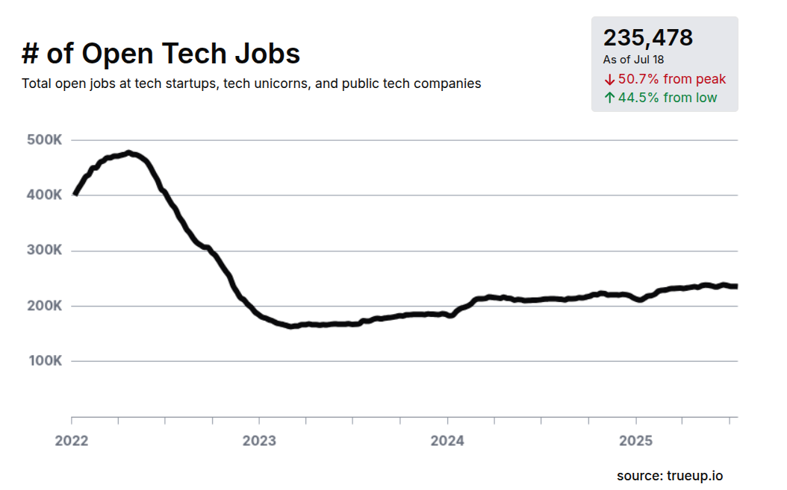

## Doing better in AI Era

AI is here and is creating disruption. Does not matter how good or bad AI it is, the fact is that is changing people perceptions and behavior. Some CEOs are already pushing companies to use AI very hard(like Shopify, Microsoft, Google, and X). AI is good but there is a some concerning stuff happening, like:
 * There is a overal reduction in the number of jobs available(https://www.trueup.io/job-trend).
 * There is a posibility that will reduce wages/salaries(https://thejobchicksinsideredge.substack.com/p/inside-amazons-offshoring-playbook). 

* Print screen from https://www.trueup.io/job-trend on 2025-JUL-21.

* Print screen from https://thejobchicksinsideredge.substack.com/p/inside-amazons-offshoring-playbook on tweet of JUL 6, 2025.

 
Some of this movements are not enterily to AI credit, for instance, the pandemic(COVID/2019) was a big facotr in slowing down enough the economy and TECH was in a bubble(free money in USA is over). Companies always like to optimize and reduce costs, and people are very exmpensive. So some of this movements have nothing todo with AI but combined we are in a complex situation where things are a bit harder and more uncertain and way more competitive than before.

I'm mostely optimistic about AI and do belive in Jevons paradox(https://en.wikipedia.org/wiki/Jevons_paradox). I dont think AI is magic and will replace all engineering but if you suck, if you performance is very poor you are at high risk. So we must be doing better. 

## Producing Code

Considering Generative AI, producing code(even a lot of it) is nothing now a day. Anyway can produce a lot of code. So do not think producing code is the most impressive thing. However producing good code still matterns, knows proper design, testing, and architecture are very important skills. Why I'm talking about this? Because you must change your mind and mindset and delivery, delivery matters the most but just deliverying is not good enought never was and never will be. You must deliver good code, that is maintainable, testable, and scalable.

## Review Pressure

Since producing code is trivial and it can be done in large quantities all the presure is on the reviewers. So you must not throw code(or AI generated code) in others withoout reviwing and understanding it deeply, you must do you homework, meaning:
 * Before submiting code to others, review and understand it deeply.
 * You must know everything all the time.
 * If you are touching the code, you must know.
 * If you are presenting something you must know all of it.
 * It cannot have a string you don't understand and dont know how it works - know it all.
 * Is there a language feature or token? you must kwnow it.
 * There is a text taling about algorithims or some technique like Cache Locality or Greedy Algorithms? You must know it.
 * IF you don't know you:
   * Must learn it.
   * Must do a POC.
   * Must see videos on the web.
   * Must read papers and the official documentation.

## Be a Killer when the matter is delivery

1. Always meet people expectations and deadlines.
2. Always do more than people asked of you.
3. Always do a lot of tests.
4. Always understand everything you are doing.
5. Always be proactive and take the lead, ask questions and be on TOP of everything.
6. Always compare with other solutions, do benchmarks and different implementations.
7. Always have great documentation and do great UI/presentations.