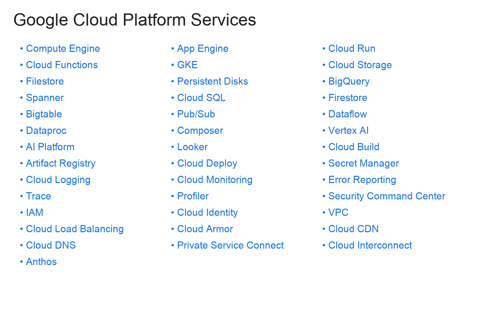

## GCP Resources

#### Important Topics

* [SOA](http://www.soa-manifesto.org/)
* [Containers](https://en.wikipedia.org/wiki/Docker_(software))
* [Cloud Computing](https://en.wikipedia.org/wiki/Cloud_computing)

#### Tech

* [Compute](https://cloud.google.com/products/compute/)
* [Storage](https://cloud.google.com/products/storage/)
* [Networking](https://cloud.google.com/products/networking/)
* [Big Data](https://cloud.google.com/products/big-data/)
* [ML](https://cloud.google.com/products/machine-learning/)
* [Management Tools](https://cloud.google.com/products/management/)
* [Kubernetes](https://kubernetes.io/)
* [TensorFlow](https://www.tensorflow.org/)
* [Cloud Spanner](https://cloud.google.com/spanner/)
* [Cloud Functions](https://cloud.google.com/functions/)
* [GKE](https://cloud.google.com/container-engine/)

#### Books

* [Google Cloud Platform in Action](https://www.amazon.com/Google-Cloud-Platform-Action-Geewax/dp/1617293520/ref=sr_1_1?ie=UTF8&qid=1499203188&sr=8-1&keywords=google+cloud)
* [Google Compute Engine](https://www.amazon.com/Google-Compute-Engine-Managing-Computing-ebook/dp/B00QXWIWLS/ref=mt_kindle?_encoding=UTF8&me=)
* [Data Science on Google Cloud Platform](https://www.amazon.com/Data-Science-Google-Cloud-Platform/dp/1491974567/ref=sr_1_4?ie=UTF8&qid=1499203188&sr=8-4&keywords=google+cloud)
* [Kubernetes: Up and Running](https://www.amazon.com/Kubernetes-Running-Dive-Future-Infrastructure/dp/1491935677/ref=pd_sim_14_4?_encoding=UTF8&pd_rd_i=1491935677&pd_rd_r=TSZ7HEYA6PEK3S3DN8NC&pd_rd_w=2zxgc&pd_rd_wg=8MSeP&psc=1&refRID=TSZ7HEYA6PEK3S3DN8NC)

#### Links

* [Google Cloud Platform Blog](https://cloudplatform.googleblog.com/)
* [GCP Big Data Blog](https://cloud.google.com/blog/big-data/)
* [Google Cloud on Medium](https://medium.com/google-cloud)
* [Kubernetes Blog](http://blog.kubernetes.io/)
* [Google Cloud Twitter](https://twitter.com/googlecloud)
* [GCP WordPress](https://mn.wordpress.com/tag/gcp/)
* [GCP Tutorials](https://cloud.google.com/docs/tutorials)
* [GCP Community Tutorials](https://cloud.google.com/community/tutorials/)
* [GCP Podcast](https://www.gcppodcast.com/)
* [Google Codelabs Cloud](https://codelabs.developers.google.com/?cat=Cloud)
* [Google Cloud Twitter](https://twitter.com/googlecloud)
* [GCP Big Data Twitter](https://twitter.com/gcpbigdata)
