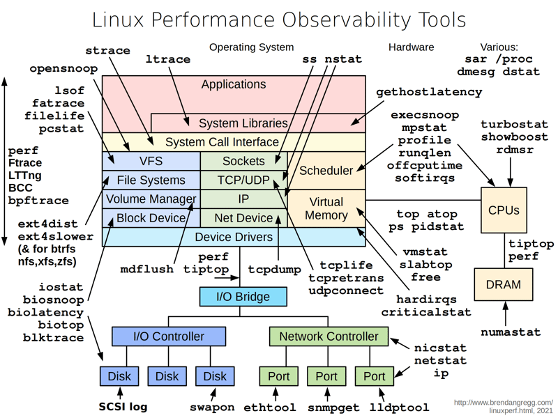

## Tech

* Terraform / OpenTofu
* AWS S3
* AWS Security Groups
* AWS Auto Scaling Groups
* AWS AMI / Packer
* AWS EC2
* AWS RDS
* AWS ELB / ALB
* AWS Router 53
* K8s / EKS
* Helm
* ArgoCD
* Jenkins / Groovy DSL
* Trivy / tfsec / Checkov / Terrascan / TFLint / KubeLinter
* Java
* Spring Boot 
* Python 3x
* Go Lang
* Postgress
* MySQL
* Redis
* Kafka
* Airflow
* Prometheus
* Grafana
* ELK
* Splunk 
* Druid
* Presto
* JVM Tunning
* GC Tunning
* Linux Tunning
* K8s Tunning
* Database Tunning
* AWS VPC Flow
* Cloud Trail
* Cloud Watch
* OpenSearch / ElasticSearch

### Code Challenges Round 1

* (1) Create a Jenkins DSL that can deploy a simple Spring Boot app (build, run tests, run sonnar and deploy in EC2) use terraform
* (2) Create a Jenkins DSL that can deploy a simple Spring Boot app (build, run tests, run sonnar and deploy in EKS) use HELM
* (3) Create a Jenkins DSL that can deploy a simple Spring Boot app (build, run tests, run sonnar and deploy in EKS) use ArgoCD
* (4) Create a Docker-Compose that has Prometheus, Spring Boot App, Grafana and ELK. All integrated and working.
* (5) Create a set of terraform scripts: deploy a but to s3, deploy a lambda, deploy a api gateway, deploy new IAM rule.
* (6) Create a simple Spring Boot App that can consume a Kafka Topic and produce a Kafka Topic. Provision a Kafka Cluster in AWS.
* (7) Create a simple Spring Boot App that can consume a Redis and produce a Redis. Provision a Redis Cluster in AWS.

### Code Challenges Round 2

* (1) Create a Python App using Flask. Should be deployed in EKS. Use Helm.
* (2) Create a Sidecar in Go that drop properties files into configmap in K8s. 
* (3) Create a Sidecar in Python 3x that drop properties files into configmap in K8s.
* (4) Create a Sidecar in Java that drop properties files into configmap in K8s.
* (5) Create a Sidecar in Go that load credentials from AWS ASM and drop into configmap in K8s.
* (6) Create a Sidecar in Python 3x that load credentials from AWS ASM and drop into configmap in K8s. 
* (7) Deploy a Spring Boot App in EKS using ArgoCD and helm. Perform Stress Tests with Terraform, tune up JVM, GC, K8s, Linux, the App JDBC Pool and the Database.

## Books

* Principles of Software Architecture Modernization https://www.amazon.com/Principles-Software-Architecture-Modernization-microservices/dp/9355519532/ref=sr_1_1?crid=7U3H2IE5U7Y4&dib=eyJ2IjoiMSJ9.ebHg7EIiJ3GThIg8Dwf4PelC70iUIbHPKv7_7zk8vrk8K2FB4zlrUQyNZwKAHPO46cAYR5z2-KyqnXqNz3Ee2lmU-aGR7NLhq7jko2UihHIl-taoJ6i_hkMjcc12ZF3pOmB9lFrvbsGgbDagq1Vzqg.oz7TxYpSBxBZjVjkuIPDZM7Wxx_XMRU0Uj7jo9Rq_BI&dib_tag=se&keywords=principles+of+software+architecture+modernization&qid=1741069169&sprefix=Principles+of+software+a%2Caps%2C190&sr=8-1
* Continuous Modernization https://www.amazon.com/dp/9365893100/ref=mes-dp?_encoding=UTF8&pd_rd_w=JpyYV&content-id=amzn1.sym.7d2923e8-7496-46a5-862d-8ef28e908025&pf_rd_p=7d2923e8-7496-46a5-862d-8ef28e908025&pf_rd_r=K6XYEHZZ76RWDSAXAY5X&pd_rd_wg=RH04x&pd_rd_r=f230b2e4-c342-429e-a362-c856e4c2362a
* The DevOps Handbook https://www.amazon.com/DevOps-Handbook-World-Class-Reliability-Organizations-ebook/dp/B09G2GS39R/ref=sr_1_1?crid=J23TSXDWR7AM&dib=eyJ2IjoiMSJ9.BbT6bWxtWqrPrx5gjOFUQrir5DUFD3frbmNM4-TIgCgu7QQdHpvkRcTVLq-KCHoBd21RdaNno96McVcd6zUcLthYoK876oJ6hmrrFLbj7GN8sIiA68CHhuprmzWNNpWlqA2T9-jjZwpBKjRmsH3LFbC-79sprFMOsyPazKri411fXeqTpYRaamhxn-DBNo04um0VmXl9o0QMtz42aFucjO29sWnuU--140TGTeiBlIg.RyNzNroqthJ6l9FmhH7oS673BYWDexv5DGhD9b79aJA&dib_tag=se&keywords=The+DevOps+Handbook&qid=1741070019&s=digital-text&sprefix=the+devops+handbook%2Cdigital-text%2C277&sr=1-1
* The Phoenix Project https://www.amazon.com/Phoenix-Project-DevOps-Helping-Business-ebook/dp/B0DPNL8863/ref=sr_1_1?crid=8G1NX5OK9ZIQ&dib=eyJ2IjoiMSJ9.wiWwt0G1guUdWgnsFDK6nal3hO4lijRYOrOZfxfZaTf-HsNtCwXfO0hOBZUDlRS-L3sZoZD6u38qiy4wNQG-r0IxV3OlrPNaI-RcyykMuXEhQpxAYAyXAj8mwQ5Qmf3CTD7oTeRiXViOI1PYkBSKQWWF3DThfHMwlGTMZR2GPTD7RYBf4FlSBzgtY_eJ3S5yjpzeCm5otrZAs2BqBnZ0c30lZ2UwUNVkNMXDh8lB9yY.IbPxgZbiFXccbFSFHnbyCw50DQ-Vcww7I-rzEw9g48g&dib_tag=se&keywords=The+Phoenix+Project&qid=1741070029&s=digital-text&sprefix=the+phoenix+project%2Cdigital-text%2C151&sr=1-1
* Accelerate https://www.amazon.com/dp/B07B9F83WM/ref=mes-dp?_encoding=UTF8&pd_rd_w=4jGOM&content-id=amzn1.sym.7d2923e8-7496-46a5-862d-8ef28e908025&pf_rd_p=7d2923e8-7496-46a5-862d-8ef28e908025&pf_rd_r=GEB389BF3C27YR5FQ0QG&pd_rd_wg=vF6D5&pd_rd_r=653af9cc-a71b-4679-8b56-a416b943275b
* Continuous Delivery https://www.amazon.com/dp/B003YMNVC0/ref=mes-dp?_encoding=UTF8&pd_rd_w=pXuk1&content-id=amzn1.sym.7d2923e8-7496-46a5-862d-8ef28e908025&pf_rd_p=7d2923e8-7496-46a5-862d-8ef28e908025&pf_rd_r=S937BBT4763JRK46JGH9&pd_rd_wg=F7mdW&pd_rd_r=d41ab563-a3cb-444b-93c9-895800f3f1fd
* Site Reliability Engineering https://www.amazon.com/Site-Reliability-Engineering-Production-Systems-ebook/dp/B01DCPXKZ6/ref=sr_1_1?crid=3VV5LT0S01YF5&dib=eyJ2IjoiMSJ9.USSaafrC7opfVDVuxgZ-7z0RV81XlRchBHRM9mXv0jHOfq5BwJDniXN77id7cJEs52JPY_8nXSgiv_ivMPwcZ8_ms6pthxJobBmmnpV2dTWC6ZyjLI5H408ClrDE0ojK54D10zlAAb5e4ftBDr9m9jkZA7hBwLITWypTbKh8UYCmxmd0d1d-wzYCiGH6P0Z1IFjohNsQbACArUXeVr9EbpC4L0d8DwWaJtSCQZwXXh0.HrNTBDkBnmRrGAuuBzbYBn3oMx6ic9mWhucwDgyYoeM&dib_tag=se&keywords=Site+Reliability+Engineering&qid=1741070089&s=digital-text&sprefix=site+reliability+engineering%2Cdigital-text%2C138&sr=1-1
* The Site Reliability Workbook https://www.amazon.com/Site-Reliability-Workbook-Practical-Implement-ebook/dp/B07FWFPMYG/ref=sr_1_1?crid=2SS94RR3AHU05&dib=eyJ2IjoiMSJ9.DQNZ_mS_1GDA3CExYRoBR61H0K11qFoqBy-wAZXfMHX1PBNO9BkAkpQWKVEBKdCt3-IrruHnWt5C-FqeRsGJTUElfXbX4NGuFLXYAZ7yIz_U4TE9qkqEs4m1fYcFHmat33kI6_ZQ2GAru-yb4wK0DG93H17qIgFKk26JQ47vcNv21aK0ajxApTk9xO3-jU-Dph0B6XtGYLQB5gaaIFXAp_owz69QP27eMDyqTRYVJQo.O-CaTVXPMCzL6GjekiIzVh9jTcX1A0oMgHuGPxXPZzc&dib_tag=se&keywords=The+Site+Reliability+Workbook&qid=1741070100&s=digital-text&sprefix=the+site+reliability+workbook%2Cdigital-text%2C153&sr=1-1
* Observability Engineering: Achieving Production Excellence https://www.amazon.com/dp/B09ZQ6FHTT/ref=mes-dp?_encoding=UTF8&pd_rd_w=silQx&content-id=amzn1.sym.7d2923e8-7496-46a5-862d-8ef28e908025&pf_rd_p=7d2923e8-7496-46a5-862d-8ef28e908025&pf_rd_r=QJZ8TFH5DT8XJXEANCE4&pd_rd_wg=KQq5x&pd_rd_r=cca1a16b-470e-446b-b1a8-a135ce447bed
* Refactoring Databases: Evolutionary Database Design https://www.amazon.com/Refactoring-Databases-Evolutionary-Addison-Wesley-Signature-ebook/dp/B0DHY617PD/ref=sr_1_2?crid=1QNITR8ADX418&dib=eyJ2IjoiMSJ9.Mgmjte1N_iknsu2Xw0EdQJuZfe5t9RUUL4SNkdTNtqwZvXwdVSNvPaeO5ubNOEjVXGmD9YSBsY6zSX1bZMgnv3mjudEOKRsBR-En3oG3ojT3px51KJzJcfruJGBRx_0NDkh7yajOmKk0mB7AyDLIcLm5ivIYvmlW-Cy458LFLF1kRJ5ifGDFO7FiPAZ-3skwXCAXE0ZzhhA_cH__DHgRjFyFK5uN7SOoRwg_vM4s9KW6HrY3zCs7dmjMwjvCYe-qDEPxrCYrUfwQPIGMHYDpthyhdkeBM2LiTGaoc3O2GlY.OJIGcek6--srp3ttBg1SQShUWg9C4cakqJfnKGxX8H0&dib_tag=se&keywords=database+refactoring&qid=1741070303&s=digital-text&sprefix=database+refacrtoring%2Cdigital-text%2C145&sr=1-2
* Data Intensive Applications https://www.amazon.com/Designing-Data-Intensive-Applications-Reliable-Maintainable-ebook/dp/B06XPJML5D/ref=sr_1_1?crid=JFZ55X89JHP0&dib=eyJ2IjoiMSJ9.ScUjfrRSlTSXTtLBuC0DXSaGKqlDdMwB7RFFyk_gcKP4jt2pDMT94khvobsJMaNq72IkRPo9wTbaQXjmL-9KfbpZU10rAql-hnEAhaVPGb1S7byM4yRclet2dUkElNuJQZwvdaYhfa3-tcK8V2RwXHXroiDjncQeyWoZaiexa5KGJUKYK4VHd-zHeNdg7bVGWQtHGl1Wb4hqD_yw6YBcfun24Dkt_PHxfXbyNdfj7c4.zD0O-vfQNqa5amOI6UnYqbGp-6RNl1NuJo5hBbgLSJ4&dib_tag=se&keywords=Data+Intensive+Applications&qid=1741665534&sprefix=data+intensive+applications%2Caps%2C213&sr=8-1

## All the Things Devops

* [Leanr DevOps The Hard Way by Diego Pacheco](https://trello.com/b/ZFVZz4Cd/devops-learning-the-hard-way)

## Useful Information

* [Cloud Egress Costs](https://getdeploying.com/reference/data-egress)
* [AWS Instances Cost](https://instances.vantage.sh/)
* [AWS Network Guide](https://www.ducktyped.org/p/a-mini-book-on-aws-networking-introduction)
* [S3 Scalability](https://bigdata.2minutestreaming.com/p/how-aws-s3-scales-with-tens-of-millions-of-hard-drives)

## Lean all this tools for Troubleshooting in Linux

