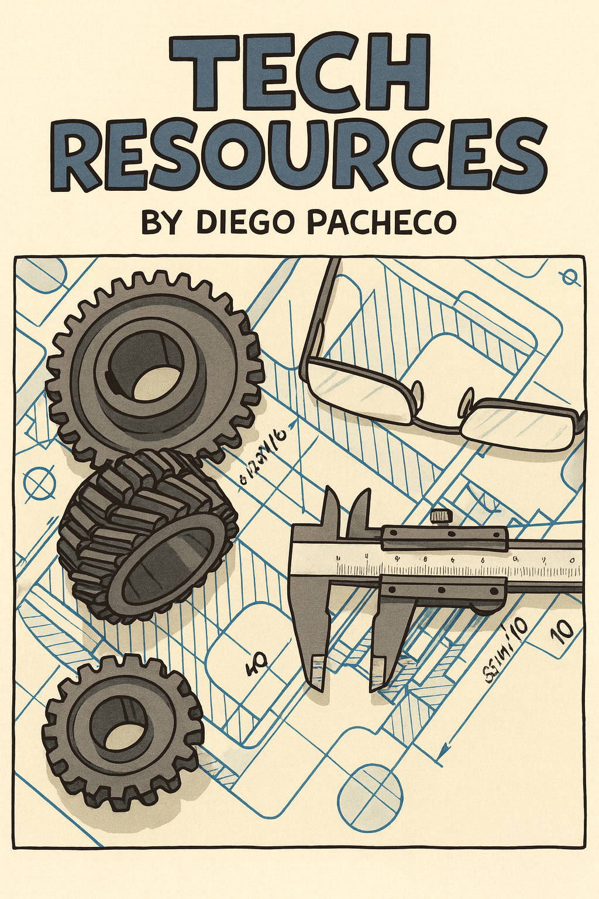

## Tech Study

I have this repository since 2017. I always had this collections of resources to give "tips" and "directions" to people I was mentoring/coaching.

Tech Support Guidance and tips - Since 2017.
[Online Book](https://diegopacheco.github.io/tech-resources/)

#### How to use this gist?

This gist contains lists of resources about JS, Mobile, Architecture/DevOps and Cloud Native. Each gist has a list   
of technologies that you can do POC and CODE practice, also with a list of useful books and links.   

#### Method

* Create a github repository called sandbox-<track> where track is: js,ArchDevOps,CN or Mobile. 
* Code every week some POC or feature impl of each technology on the lsit.
* You should be reading one book at the time. You need make notes from your readings.
* Reading 10 pages per week is progress, you should push your self to read some pages everyweek.
* After reading and coding for some time about a specific subject lets say Automation/Ansible consider doing a LT.
* You need to understand what you are coding, ask for code review. 
* You need make sure you got concepts right, validate with more experienced engineers. 
* Progress is best tracked in Weekly Coaching Sessions. 
* Balance is always welcome. You might use the Breath/Deepth method where 90% time invested on main topic and 10% on random.
* No matter your specific field like JS or CN you should read all this book: [Agile Dev Resources](./agile-dev-resources.md)

### JS

[JavaScript Frontend Resources](./js-frontend-resources.md)

### Mobile

[Mobile Resources](./mobile-resources.md)

### Cloud Native

[Cloud Native Resources](./cloud-native-resources.md)

### Software Architecture | DevOps Engineering

[Architecture DevOps Resources](./arch-devops-resources.md)

### GCP

[GCP Resources](./GCP-resources.md)

#### POC Ideas

* Get all language/framework/lib features and do some simple code.
* Most of technical books have sample codes and excercis you can use for POC.
* Look for a problem in your project or company or something you could improve.
* [99 Problems](http://www.ic.unicamp.br/~meidanis/courses/mc336/2009s2/prolog/problemas/)
* [Dojo Puzzle](http://dojopuzzles.com/)
* Create a simple version(smaller scale) of:
* - Facebook
* - Twitter
* - Netflix
* - Flickr
* - Slack
* - GitHub

Cheers,  
Diego Pacheco

## Disclaimer

I have had this repository since `2017`. There are no proprietary materials from past or future employers.
I have been doing coaching/mentorship with tech professionals for decades. Here you will find links to coding problems, books, tech, what to learn, and my take on several things, alongside links to my books and my blogs.  
